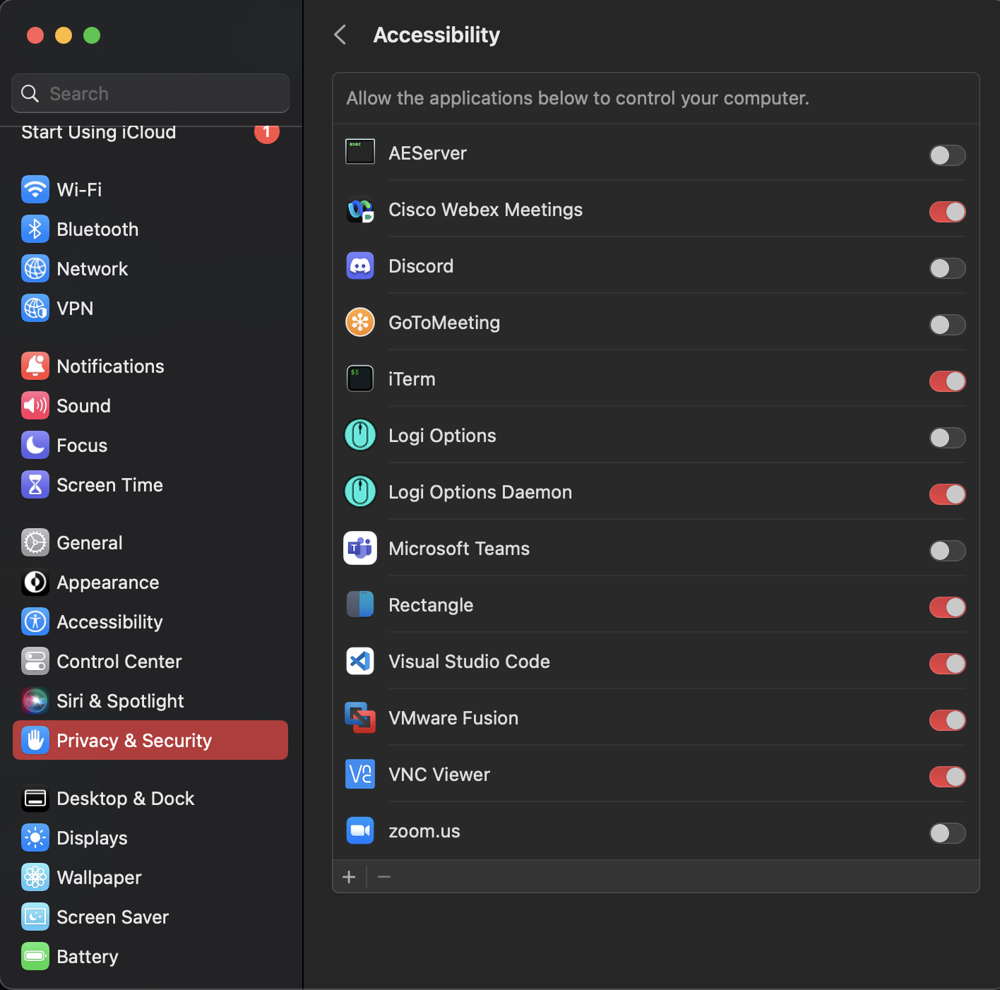

# CopyPasta

Simple python application written by WJDigby and whooly refactored to use only flask.

# Why?

Copying and pasting when you use VMs is awful, go deploy this in a container and away you go.


## Usage

```
docker run --name copypasta -d -p 443:443 -v "/opt/copypasta:/opt/copypasta/uploads" copypasta
```


## Usage of `type.py`

Also included is a script that will take in text (in a GUI) or a file (in a CLI) and virtualize a keyboard to send that file / text as keystrokes with a given delay.

```
Usage: type.py [OPTIONS] COMMAND [ARGS]...

Options:
  --help  Show this message and exit.

Commands:
  cli  CLI for typing a file out
  ui   Display a UI for pasting in text
```

### Install on MacOS

To use on MacOS, you must enable the "Accessibility" of whatever application you are running this from (if you are running from a terminal in VSCode, you must allow VSCode in your MacOS settings and if you use it from Terminal, you must allow Terminal in your settings).




You will also need to install `tkinter` using brew:

```bash
brew install python-tk
```

And install all pip dependencies:

```bash
python3 -m pip3 install -r requirements.txt
```